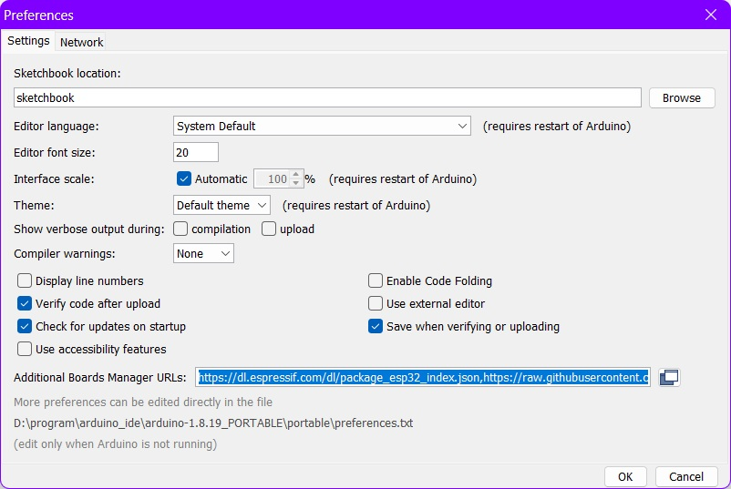
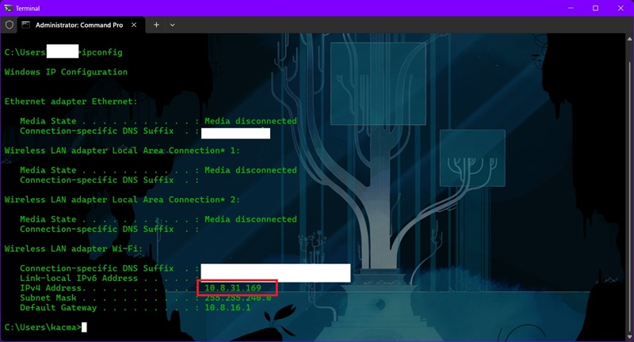
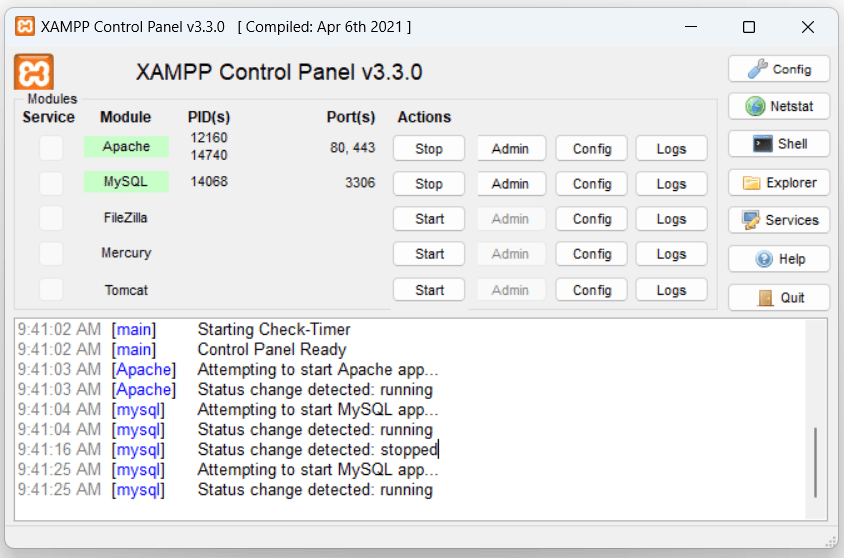
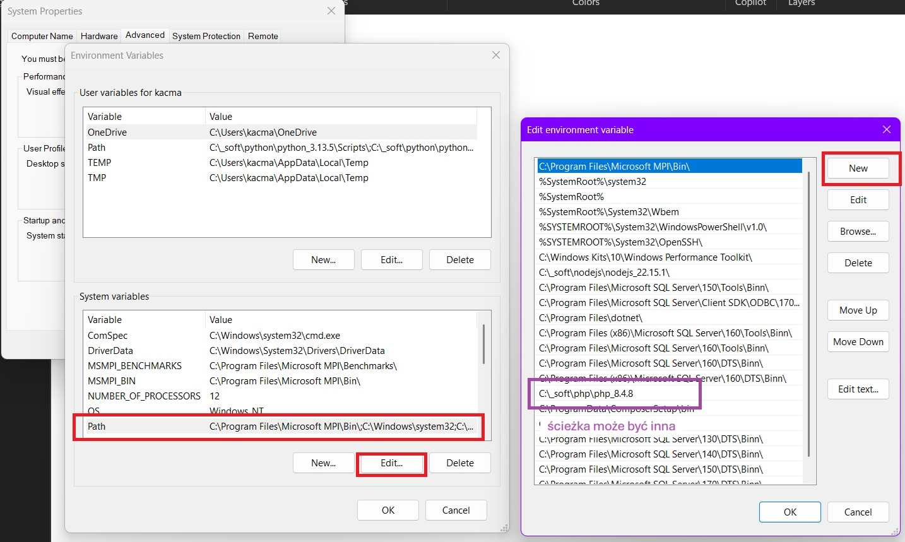

1. [ Potrzebne materiały ](#Potrzebne)
1. [ Widok złożenia ](#Widok)
1. [ Schemat połączeń ](#Schemat)
1. [ Instalacja środowiska Arduino IDE ](#Arduino)
1. [ Instalujemy sterownik komunikacyjny ](#ESP-WROOM-32)
1. [ Instalujemy inne sterowniki ](#biblioteki)
1. [ Instalacja serwerów lokalnych ](#Serwery)
1. [ Aplikacja internetowa ](#Aplikacja)
1. [ Wgrywanie szkicu do ESP8266 ](#Wgrywanie)

# Projekt wykonany na zaliczenie przedmiotu: Systemy Internetu Rzeczy.
> ***Projekt opiera się na technologiach OpenSource, na ich dokumentacjach. Linki do dokumentacji:***
> * https://laravel.com/docs/12.x
> * https://docs.arduino.cc/programming

<a name="Potrzebne"></a>
## Potrzebne materiały

* Mikrokontroler z modułem WiFi: ESP-WROOM-32


* Płytka Stykowa 830 połączeń (mniej lub więcej: ok)


* Wyświetlacz OLED o przekątnej 1.3" (inny wymiar: ok)


* Przewody połączeniowe męsko-męskie (naręcze)


* Przyciski monostabilne (automatycznie odbijają po wciśnięciu) x2


* Rezystory 10 kOhm x2


* Przewód komunikacyjny microUSB między Mikrokontrolerem ESP32 - komputerem


<p>Elementy można kupić razem w zestawie dla początkujących lub jako osobne produkty.<p>
<p>Polecana strona: <a href="https://botland.com.pl" target="_blank">https://botland.com.pl</a></p>

<a name="Widok"></a>
## Widok złożenia


<a name="Schemat"></a>
## Schemat połączeń


<p>Połączenia na Twojej płytce stykowej (tej białej) mogą się różnić od przedstawionych na schemacie. To normalne i zależy od zakupionego sprzętu. Ważna jest jednak zgodność nazw pinów. W przypadku kontrolera znajdującego się z tyłu wyświetlacza OLED nazwy mogą się różnić, proszę zwrócić uwagę na kolejność podłączeń. Nazwy jednak nie powinny się różnić w przypadku Mikrokontrolera ESP32.</p>


<p>Proszę się przyjrzeć nazwom pinów na płytce ESP32 powiększając zdjęcie</p>

<a name="Arduino"></a>
## Instalacja środowiska Arduino IDE

<p align="justify">Pobieramy Arduino IDE w najnowszej wersji dla naszego systemu operacyjnego oraz instalujemy postępując zgodnie z kreatorem. <a href="https://www.arduino.cc/en/software" target="_blank">Link</a></p>

<h4>Dodatkowo należy zainstalować sterownik na porty USB naszego komputera</h4>

1. Sterownik pobieramy ze strony <a href="https://www.silabs.com/software-and-tools/usb-to-uart-bridge-vcp-drivers?tab=downloads" target="_blank">silabs.com</a>

2. Należy pobrać plik o nazwie: CP210x Universal Windows Driver lub podobnej jeśli wyszła nowsza wersja.

3. Teraz należy rozpakować plik.zip

4. W rozpakowanej strukturze znajdziemy instalator: silabser.inf

5. Klikamy na niego PPM -> Install. Proszę postępować zgodnie z instrukcjami kreatora.

<a name="ESP-WROOM-32"></a>
## Instalujemy sterownik komunikacyjny między: ESP-WROOM-32 oraz naszym komputerem

<strong>Interfejs programu omawiany zostanie w języku angielskim</strong>

1. Otwieramy zainstalowane w poprzednim kroku Arduino IDE

2. Klikamy w menu programu: File -> Preferences

3. Tutaj należy odszukać: Additional Boards Manager URLs

4. Obok powinno się znajdować Pole Tekstowe, należy wkleić:

> ***https://dl.espressif.com/dl/package_esp32_index.json,https://raw.githubusercontent.com/espressif/arduino-esp32/gh-pages/package_esp32_index.json***



5. Potwierdzić okno dialogowe
	
6. Teraz przechodzimy w menu: Tools -> Board [...] -> Boards Manager

7. W pasku wyszukiwania wprowadzamy: "esp32"

8. Wybieramy najnowszą wersję oraz klikamy przycisk [Install] i postępujemy zgodnie z kreatorem

<a name="biblioteki"></a>
## Instalujemy inne sterowniki (biblioteki) od osób trzecich

1. Wchodzimy po kolei w linki poniżej
2. Należy odnaleźć przycisk do pobierania paczki.zip<br />
(Na dzień: 18-12-2025) Klikamy zielony przycisk Code -> Download ZIP<br />
Adafruit GFX: <a target="_blank" href="https://github.com/adafruit/Adafruit-GFX-Library">https://github.com/adafruit/Adafruit-GFX-Library</a><br />
Adafruit Bus IO: <a target="_blank" href="https://github.com/adafruit/Adafruit_BusIO">https://github.com/adafruit/Adafruit_BusIO</a><br />
ESP32 sh1106 OLED: <a target="_blank" href="https://github.com/nhatuan84/esp32-sh1106-oled">https://github.com/nhatuan84/esp32-sh1106-oled</a>
3. Po pobraniu otwieramy Arduino IDE
4. Klikamy w menu: Sketch -> Include Library -> Add .ZIP Library
5. Teraz należy odszukać pobrane bibliotki na komputerze
6. Powtarzamy od kroku 4. dla każdej biblioteki

<a name="Serwery"></a>
## Instalacja serwerów lokalnych HTTP oraz SQL

Serwer lokalny HTTP służy do obsługi mikrokontrolera ESP32.
Serwer lokalny SQL służy do przechowywania danych naszej aplikacji (stworzymy ją później).

### Podgląd adresu IP w naszej sieci wifi

1. Otwieramy terminal (Windows: Win + R: cmd.exe)
2. Wklejamy: ipconfig
3. Odszukujemy wpis: Wireless LAN adapter Wi-Fi
4. Odszukujemy podwpis: IPv4 Address<br />
Tutaj znajduje się adres IP naszego komputera. U mnie przykładowo jest: 10.8.31.169<br />
Nasz komputer jest serwerem w sieci wifi. Ten adres IP będzie nam później bardzo potrzebny.<br />
Niestety adres IP może się deaktualizować, ważne żeby każdorazowo uruchamiając projekt adres ten był poprawny.<br>
Aktualizować musimy go ręcznie, później pokażę gdzie należy go wkleić.<br />



### Środowisko serwerowe na komputerze lokalnym

1. Pobieramy instalator z: <a href="https://www.apachefriends.org/pl/index.html" target="_blank">https://www.apachefriends.org/pl/index.html</a>
2. Otwieramy instalator i przeklikujemy zachowując ustawienia domyślne.
3. Odpalamy panel kontrolny wpisując w Menu Start: XAMPP
4. Klikamy przyciski: Start obok Apache oraz MySQL<br />
Jeśli instalacja przebiegła pomyślnie to nazwy serwerów powinny wyświetlać się z zielonym tłem.<br />



5. Klikamy przyciski Explorer, powinien otworzyć się folder o nazwie "htdocs"

<p><strong>Teraz należy dodać folder z programami pomocniczymi do zmiennej środowiskowej</strong></p>

1. Otwieramy Menu Start
2. Wklejamy: View advanced system settings
3. Otwieramy zakładkę: Advanced -> Environment Variables
4. Szukamy: "System variables" i wybieramy Path
5. Klikamy przycisk Edit
6. Klikamy przycisk New
7. Wklejamy ścieżkę: C:\xampp\php<br />
lub inną w zależności od procesu instalacyjnego (powinna kończyć się na "\php")



8. Wklejamy jeszcze jedną ścieżkę: C:\xampp\mysql\bin
9. Na końcu wszystkie okna można zaakceptować i zakończyć
<p><strong>Teraz proszę zamknąć (jeśli jest otwarty) i otworzyć jeszcze raz terminal (Ctrl + R: cmd.exe)</strong></p>

<a name="Aplikacja"></a>
## Aplikacja internetowa do dodawania zadań

Aplikacja będzie dostępna przez przeglądarkę internetową. W pasku url należy wpisać: `localhost/restaurakcja/public`<br />
W odpowiednim momencie skorzystamy z okna logowania.

### Tworzenie bazy danych

<p>Zanim będziemy mogli pracować w aplikacji musimy stworzyć miejsce gdzie będziemy przechowywać dane.</p>

1. Otwieramy terminal i wklejamy: mysql -u root -p
2. Klikamy enter podając puste hasło
3. Wklejamy: create database restaurakcja character set utf8mb4;
4. Zatwierdzamy enter-em
5. Wpisujemy żeby zamknąć klienta MySQL: \q

### Instalator API Composer

Program Composer pozwala dociągać potrzebny kod, z repozytorium internetowego.<br />
Będzie to nam potrzebne w celach synchronizacyjnych z najnowszymi wersjami kodu.

1. Wchodzimy na stronę: https://getcomposer.org/download/
2. Pobieramy instalator w najnowszej wersji.
3. Proszę postępować zgodnie z instrukcjami.

Wszystko w tym momencie już powinno działać po stronie Composera.

### Instalacja aplikacji

1. Pobieramy wszystkie pliki aplikacji na komputer, znajdują się na ___githubie ***/restaurakcja***___
2. Otwieramy folder o nazwie "htdocs" z wcześniej.
3. Przenosimy do niego wszystkie pliki tak żeby tworzyły strukturę: /htdocs/restaurakcja/[tutaj będzie folder /app i inne]
4. Kopiujemy plik do tego samego folderu: /restaurakcja/.env.example
5. Zmieniamy nazwę na .env
6. Edytujemy wyszukując linijki (można wykorzystać narzędzie do wyszukiwania po frazach: Ctrl + F w notatniku). Należy usunąć "#" na początku każdej edytowanej linijki jeśli taki występuje!<br />
```.env
APP_NAME=Restaurakcja
APP_URL=http://localhost/restaurakcja/public
DB_CONNECTION=mysql
DB_HOST=127.0.0.1
DB_PORT=3306
DB_DATABASE=restaurakcja
DB_USERNAME=root
DB_PASSWORD=

```
7. Otwieramy XAMPP-a -> wyłączamy i włączamy serwer Apache przyciskiem Stop/Start
8. Otwieramy terminal i przechodzimy do folderu z projektem: `cd C:\xampp\htdocs\restaurakcja`<br />
Lokalizacja może się różnić w zależności od miejsca instalacji programu XAMPP.
9. Wklejamy: composer install<br />
Teraz należy poczekać. Polecenie będzie się wykonywać długo.
10. Wklejamy: `php artisan key:generate`
Następnie przygotowujemy bazę danych.
11. `php artisan migrate:fresh --seed`
Już prawie koniec, zostało stworzenie frontend-u aplikacji (wyglądu)
12. `npm install`
13. `npm run build`

### Generowanie klucza API

<p>Klucz API to ciąg znaków, który należy skopiować i wkleić w dalszej części tutoriala</p>
<p>Podobnie jak ma to miejsce z adresem IP naszego komputera, na którym zainstalowane są serwery</p>

1. Wklejamy w przeglądarce w pasku url: `localhost/restaurakcja/public`
2. Logujemy się podając poświadczenia: default@localhost/phplaravel
3. Wklejamy w przeglądarce: `localhost/restaurakcja/public/api/tokens/create`
4. Zapisujemy na kartce papieru TOKEN DOSTĘPU, będzie potrzebny później

<a name="Wgrywanie"></a>
## Wgrywanie szkicu do ESP32

<p>Przed wykorzystaniem Arduino IDE należy fizycznie podłączyć Mikrokontroler ESP32.</p>
<p>Wykorzystujemy przewód microUSB. Po podłączniu powinna zapalić się dioda LED (przykładowo: czerwona)</p>
<p><strong>Proszę nie dotykać elektroniki w celu uniknięcia zwarcia, chyba że odłączamy przewód.</strong></p>

### Ustawienie Arduino IDE

1. Model płytki z ESP32
Klikamy w menu: Tools -> Boards -> ESP32 Arduino -> ESP32 Dev Module
2. Port szeregowy komunikacyjny, z komputera do mikrokontrolera ustawiamy klikając w menu: Tools -> Port -> COMX (gdzie X jest zależne od naszego komputera, u mnie: "COM3")

### Teraz należy przygotować plik z programem (tzw. szkic)

1. Szkic pobieramy na komputer, znajduje się na ___githubie ***restaurakcja.ino***___

2. Otwieramy plik przez menu: File -> Open, odszukujemy pobrany szkic

3. Należy odszukać w kodzie i zaktualizować podane niżej linijki

```C++
#define MY_SSID "[nazwa naszej sieci wifi]";
#define MY_PASSWD "[hasło naszej sieci wifi]";
#define MY_SRV "https://[IP NASZEGO KOMPUTERA]/restaurakcja"
#define MY_AUTH_SRV "" // to można zostawić puste

const char *ssid = MY_SSID;
const char *password = MY_PASSWD;
const char *server = MY_SRV;
const char *auth_server = MY_SRV;
const char *apiToken = "[to wypełniamy wygenerowanym TOKENEM DOSTĘPU]";
```

4. Klikamy przycisk Verify (teraz nastąpi kompilacja), proszę poczekać kilka-kilkanaście minut

<p>Przycisk Verify powinien znajdować się w Arduino IDE: pod menu, na wstążce</p>

### Wgrywamy program do mikrokontrolera

<p>Klikamy przycisk Upload: znajdujący się na wstążce</p>

<p>Niedługo powinniśmy ujrzeć napis: "Connecting..." na wyświetlaczu OLED obok płytki ESP32 :)</p>