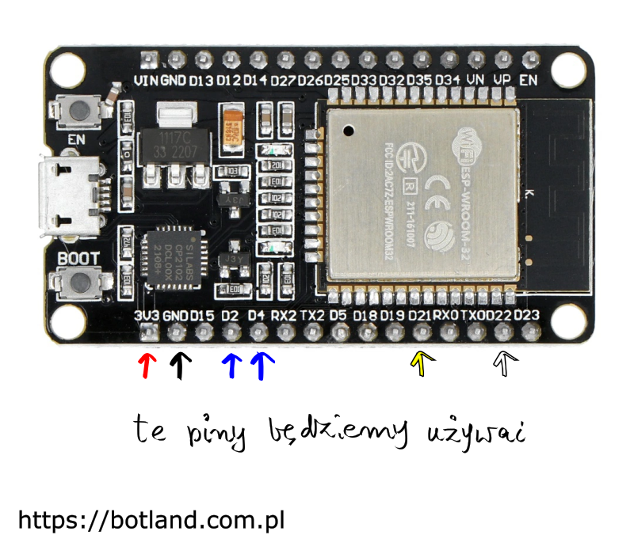
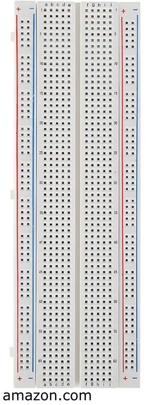
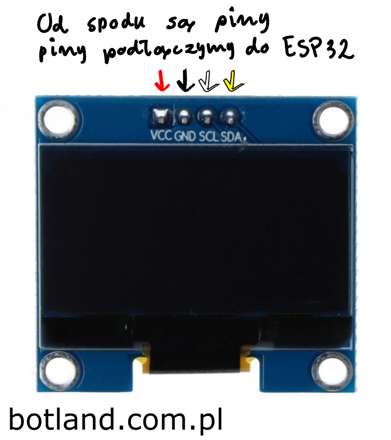
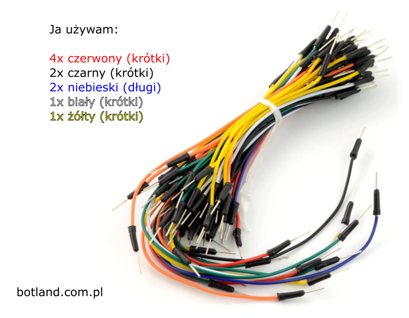
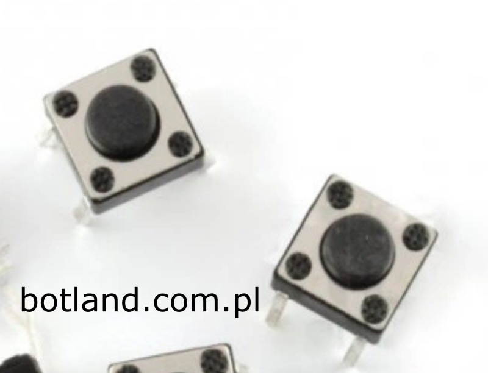
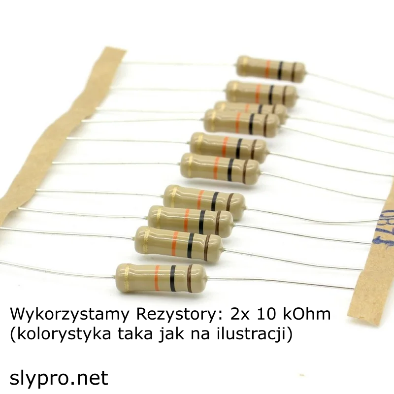
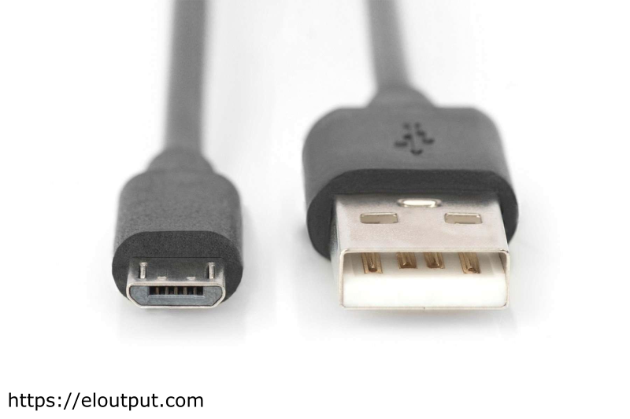
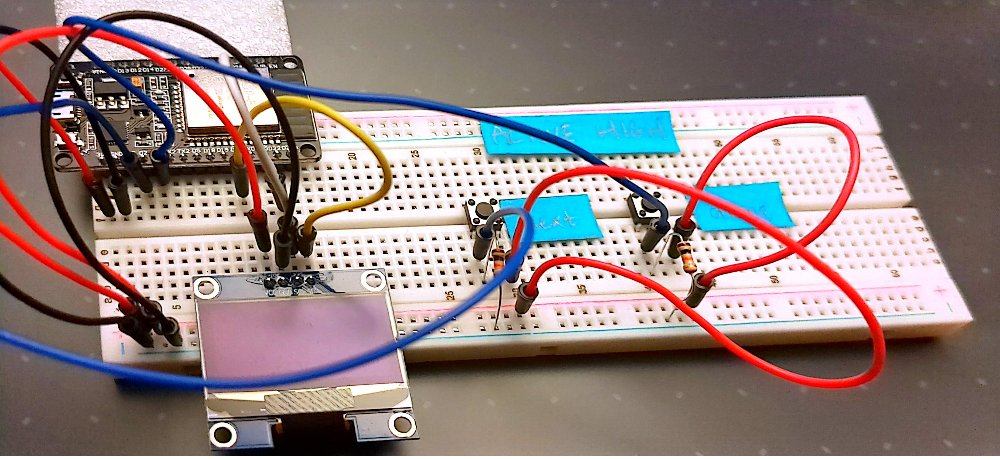
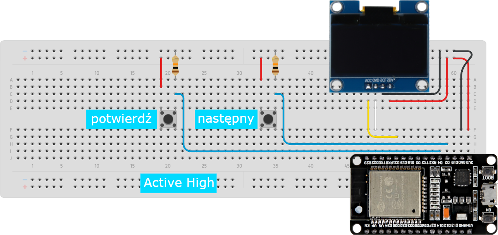
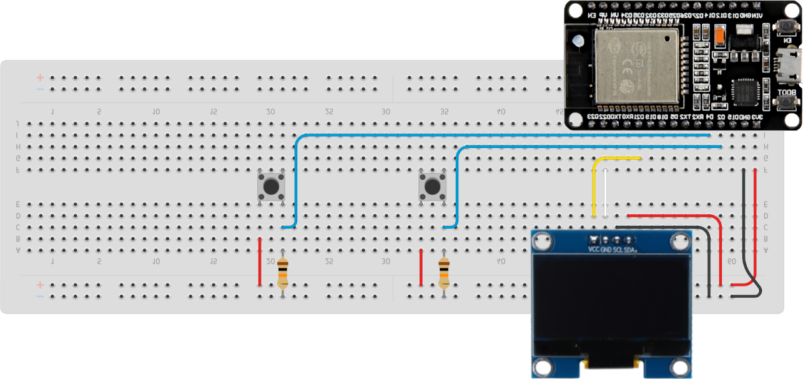

1. [ Potrzebne materiały ](#Potrzebne)
1. [ Widok złożenia ](#Widok)
1. [ Schemat połączeń ](#Schemat)
1. [ Instalacja środowiska Arduino IDE ](#Arduino)
1. [ Instalujemy dodatek do obsługi ESP8266 ](#ESP-WROOM-32)
1. [ Instalujemy potrzebne biblioteki ](#biblioteki)
1. [ Wgrywanie szkicu do ESP8266 ](#Wgrywanie)

# Projekt wykonany na zaliczenie przedmiotu: Systemy Internetu Rzeczy.
> ***Projekt opiera się na technologiach OpenSource, na ich dokumentacjach. Linki do dokumentacji:***
> * https://laravel.com/docs/12.x
> * https://docs.arduino.cc/programming

<a name="Potrzebne"></a>
## Potrzebne materiały

* Mikrokontroler z modułem WiFi: ESP-WROOM-32


* Płytka Stykowa 830 połączeń (mniej lub więcej: ok)


* Wyświetlacz OLED o przekątnej 1.3" (inny wymiar: ok)


* Przewody połączeniowe męsko-męskie (naręcze)


* Przyciski monostabilne (automatycznie odbijają po wciśnięciu) x2


* Rezystory 10 kOhm x2


* Przewód komunikacyjny microUSB między Mikrokontrolerem ESP32 - komputerem


<p>Elementy można kupuć razem w zestawie dla początkujących lub jako osobne produkty.<p>
<p>Polecana strona: <a href="https://botland.com.pl" target="_blank">https://botland.com.pl</a></p>

<a name="Widok"></a>
## Widok złożenia



<a name="Schemat"></a>
## Schemat połączeń



<p>Połączenia na Twojej płytce stykowej (tej białej) mogą się różnić od przedstawionych na schemacie. To normalne i zależy od zakupionego sprzętu. Ważna jest jednak zgodność nazw pinów. W przypadku kontrolera znajdującego się z tyłu wyświetlacza OLED nazwy mogą się różnić, proszę zwrócić uwagę na kolejnośc podłączeń. Nazwy jednak nie powinny się różnić w przypadku Mikrokontrolera ESP32.</p>



<p>Proszę się przyjrzeć nazwom pinów na płytce ESP32 powiększając zdjęcie</p>

<a name="Arduino"></a>
## Instalacja środowiska Arduino IDE

<p>Pobieramy Arduino IDE w najnowszej wersji dla naszego systemu operacyjnego oraz instalujemy postępując zgodnie z kreatorem. <a href="https://www.arduino.cc/en/software" target="_blank">Link</a></p>

<a name="ESP-WROOM-32"></a>
## Instalujemy sterownik komunikacyjny między: ESP-WROOM-32 oraz naszym komputerem:

<strong>Interfejs programu omawiany zostanie w języku angielskim</strong>

<p>01. Otwieramy zainstalowane w poprzednim kroku Arduino IDE</p>

<p>02. Klikamy w menu programu: File -> Preferences</p>

<p>03. Tutaj należy odszukać: Additional Boards Manager URLs</p>

<p>04. Obok powinno się znajdować Pole Tekstowe, należy wkleić:<br />
<q>https://dl.espressif.com/dl/package_esp32_index.json,https://raw.githubusercontent.com/espressif/arduino-esp32/gh-pages/package_esp32_index.json</q></p>


<p>05. Potwierdzić okno dialogowe</p>
	
<p>06. Teraz przechodzimy w menu: Tools -> Board [...] -> Boards Manager</p>

<p>07. W pasku wyszukiwania wprowadzamy: "esp32"</p>

<p>08. Wybieramy najnowszą wersję oraz klikamy przycisk [Install] i postępujemy zgodnie z kreatorem</p>

<a name="biblioteki"></a>
## Instalujemy potrzebne biblioteki:

* #### DHT:
W programie Arduino IDE klikamy kolejno **Szkic > Dołącz bibliotekę &gt; Zarządzaj bibliotekami…**. W oknie wyszukiwania wpisujemy ___DHT___


* #### Podobnie instalujemy bibliotekę: "Adafruit Unified Sensor”


* #### Podobnie instalujemy bibliotekę: ___onewire___ zwracając uwagę na właściwe pochodzenie, gdyż w zasobach jest dużo bibliotek o podobnych nazwach i przeznaczeniu


* #### Oraz DS18B20:


* #### Kolejna biblioteka konieczna do utworzenia miniserwera www na ESP8266: "ESPAsyncWebServer" do zainstalowania. 

[Pobieramy ją z tej lokalizacji.](https://github.com/me-no-dev/ESPAsyncWebServer/archive/master.zip)

Pobrany plik należy rozpakować i zmienić nazwę na "ESPAsyncWebServer". Folder ten przenieść do **Moje dokumenty &gt; Arduino &gt; libraries**

* #### Powyższe kroki powtarzamy z biblioteką [ESPAsyncTCP](https://github.com/me-no-dev/ESPAsyncTCP/archive/master.zip)

* #### Kolejna biblioteka dla [barometru](https://circuits4you.com/wp-content/uploads/2019/03/BMP180_Breakout_Arduino_Library-master.zip) BMP180 do pobrania.

Instalujemy podobnie jak poprzednie. Można też wybrać: **Szkic &gt; Dołącz bibliotekę &gt; Dodaj Bibliotekę .ZIP…**

> Jeśli czujnikiem ciśnienia jest ___BMP280___ również należy zainstalować bibliotekę ("adafruit bme280") do obsługi tego czujnika.


<a name="Wgrywanie"></a>
## Wgrywanie szkicu do ESP8266

### Sterowniki do konwerterów _USB <-> serial (port szeregowy)_
Układ ESP8266 (inne mikrokontrolery podobnie) Posiadają jedynie port szeregowy (RS232). Wgrywanie oprogramowania wymaga przykładowo takiego [specjalnego programatora](https://botland.com.pl/pl/programatory/4481-programatordebugger-stm8stm32-zgodny-z-st-linkv2-mini-waveshare-10053.html?search_query=programator&results=30). Płytki takie jak _NodeMCU_, czy _WemosD1 mini_ posiadają wbudowany konwerter portu szeregowego. Przważnie jest to układ CP210x (NodeMCU v1, v2, WemosD1 mini pro)  

 
  

i CH340 (WemosD1 mini, NodeMCU v3).  
  
  
  

Przed podłączeniem płytki do komputera należy zainstalować sterowniki do tego układu.  
[Sterowniki do _CP210x_ i instrukcje jak je zainstalować można znaleźć tutaj](https://www.silabs.com/products/development-tools/software/usb-to-uart-bridge-vcp-drivers)  

[Sterowniki do _CH340_ i instrukcje jak je zainstalować można znaleźć tutaj](https://sparks.gogo.co.nz/ch340.html) 

>Uwaga *Tylko MacOS* po wgraniu sterownika należy go włączyć w **Preferencje systemowe > Ochrona i prywatność**. [Opis zamieszczono tutaj](https://github.com/adrianmihalko/ch340g-ch34g-ch34x-mac-os-x-driver.git)

### Przed wgraniem szkicu do mikrokontrolera (NodeMCU, WemosD1, i in.) należy ustawić w Arduino IDE *dwie ważne rzeczy*:
1. Model płytki z mikrokontrolerem
 
1. Port szeregowy do komunikacji ___komputer <-> płytka___
Przed podłączeniem płytki do komputera wybieramy *__Narzędzia > Port__*. W ten sposób możemy wykryć, na którym porcie pojawi się nasza płytka. 
 
Teraz podpinamy płytkę i ponownie wybieramy *__Narzędzia > Port__*
 

> UWAGA: W systemie Windows porty te będą widoczne inaczej jako **COM2, COM3** itd.
### Teraz możemy przystąpić do wgrywania szkicu, czyli piku _.ino_ do płytki 

1. Gotowy szkic należy pobrać z ___githuba___ **stacjaMeteo_bmp180.ino** lub **stacjaMeteo_bmp280.ino** 

1. Pobrany plik wgrywamy do katalogu **Dokumenty &gt; Arduino &gt; stacjaMeteo_bmp180** lub **Dokumenty &gt; Arduino &gt; stacjaMeteo_bmp280**
Otwieramy wybrany plik w Arduino IDE:  

1. klikamy  

1. Zmieniamy ustawienia sieci Wi-Fi na własne

```C++
// Zastąp danymi własnej sieci wi-fi
const char* ssid = "NAZWA_SIECI_WIFI";
const char* password = "HASŁO_SIECI_WIFI";
``` 
5. Sprawdzamy czy nie ma błędów w składni:  

1. Jeśli wszystko poszło dobrze można wgrać program:  

> Jeśli pojawiły się błędy kompilacji (z kroku 5), to najprawdopodobniej nie wszystkie wymagane biblioteki zostały zainstalowane. 
Należy się upewnić czy jakaś inna bibliotekanie nie powoduje konfliktów. Jeśli samodzielnie edytowałeś szkic to może pojawił się błąd składni. Sprawdź opis błędy (na czerwono) w czarnym okienku na dole Arduino IDE. Najczęściej zapominamy o *__„;”__* na końcu linii bądź polecenia.

<font color:red >POWODZENIA!!!</font>
